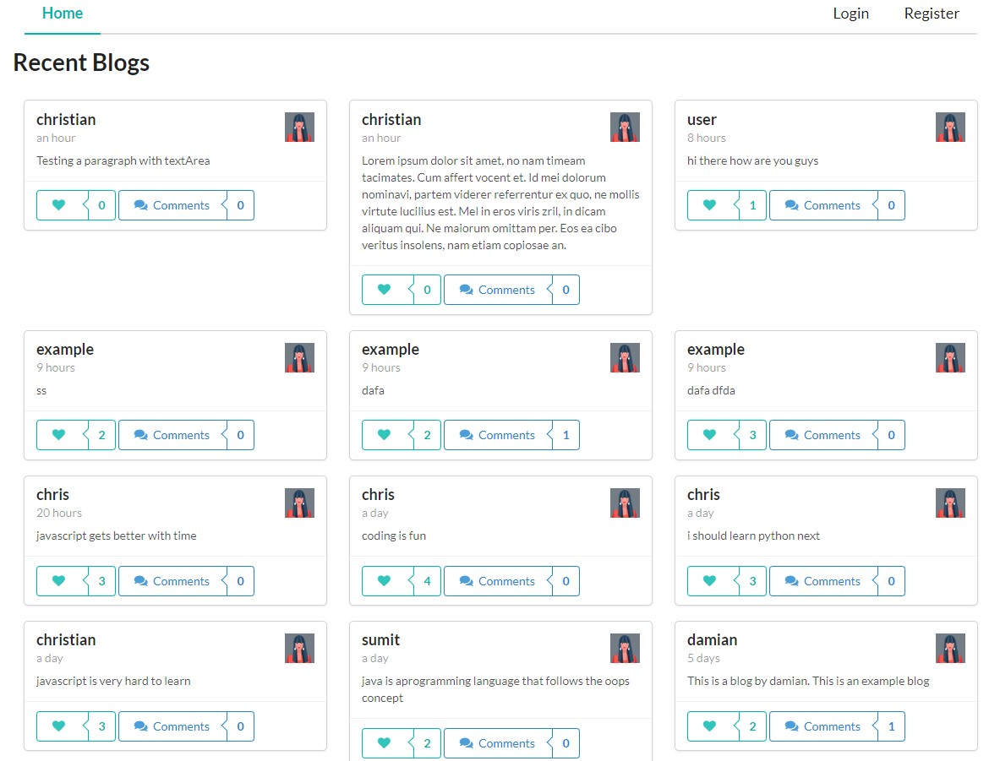
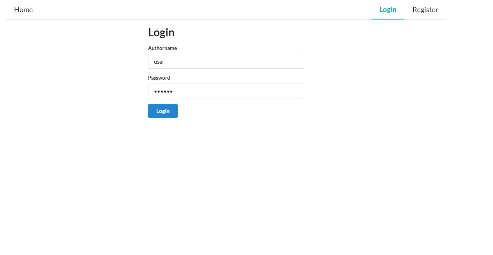
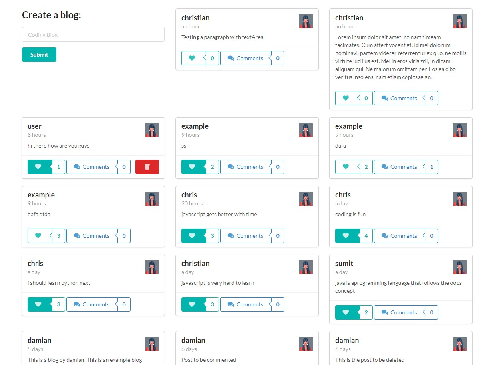
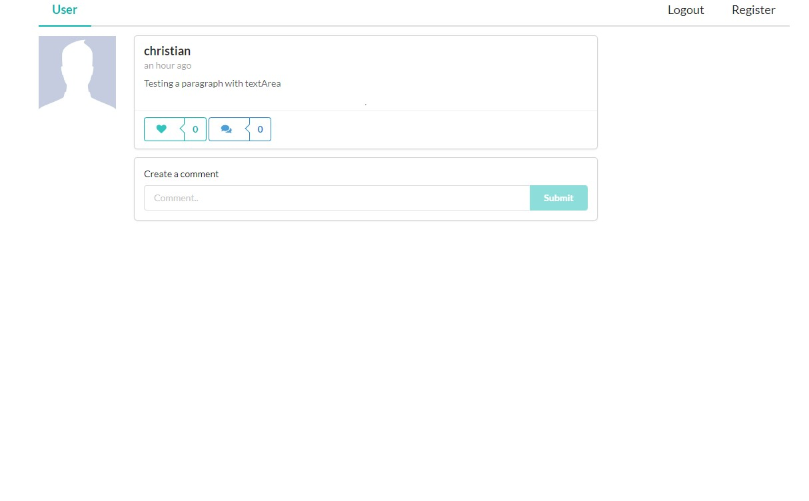
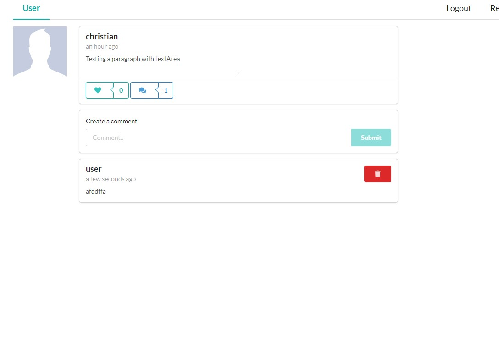

# Coding Blog

## Description

A coding blog for the tech frenzy people that includes the tutorial for the different coding fundamentals.

## Table of contents

- [Installation](#Installation)
- [Usage](#Usage)
- [Contribution](#Contribution)
- [Questions](#Questions)
- [Website](#Website)
- [Screenshots](#Screenshots)

## Installation

- npm install

## Usage

- cd server && npm start
- cd client && npm start

## Contribution

Christian Pena
Christopher Roberts
Damian De la Garza
Sumit Ojha

## Questions

- https://github.com/ChipHvzvrd
- https://github.com/Damian-dlg
- https://github.com/Robertschris44
- https://github.com/sumitsann

## Website

## Screenshots

